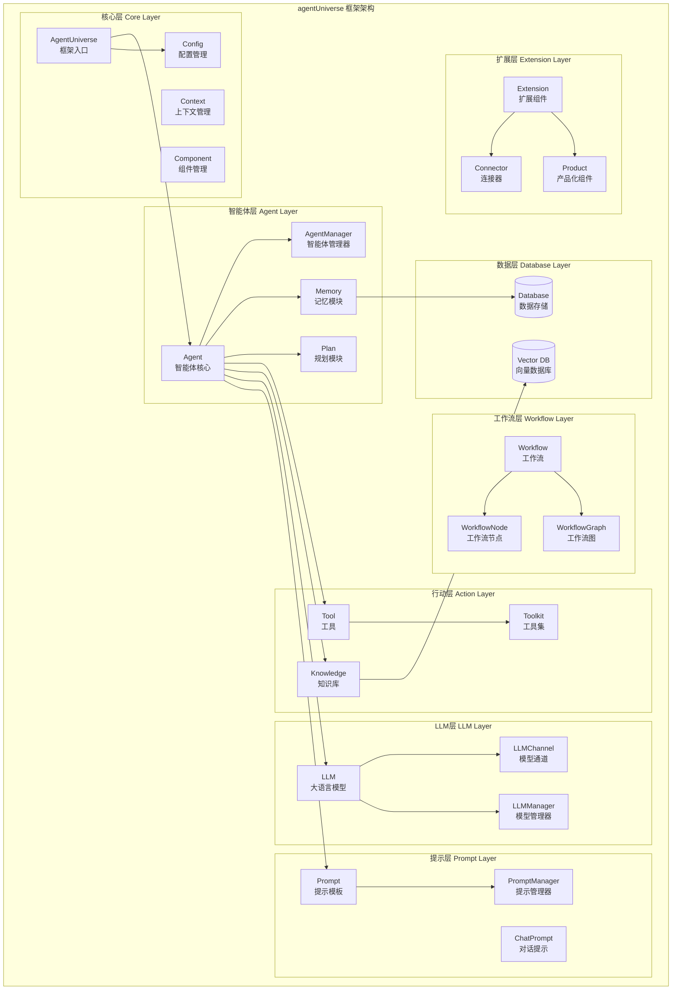
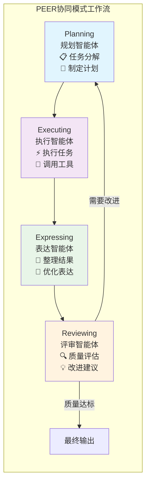
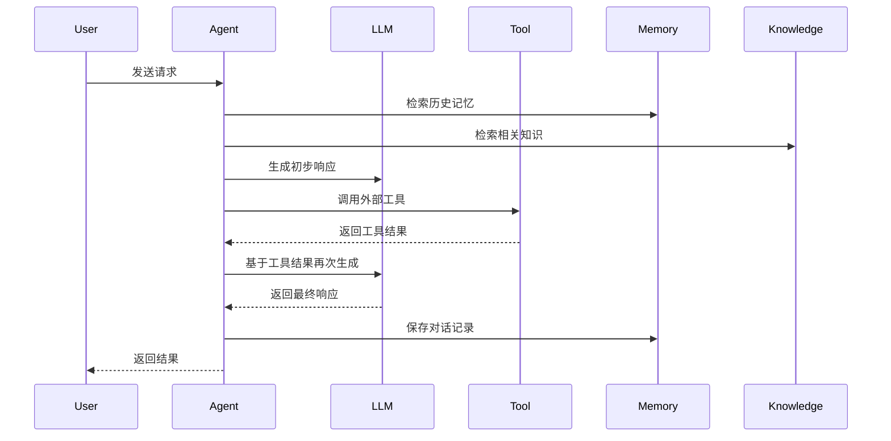
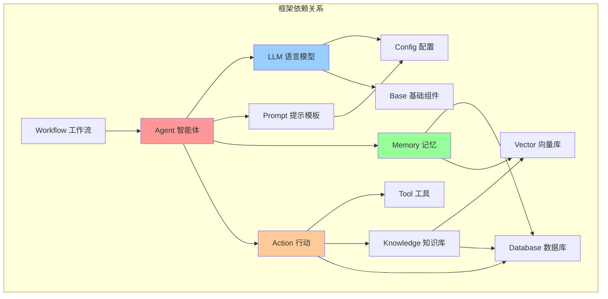

# agentUniverse 项目结构分析

## 项目概述

**agentUniverse** 是一个基于大型语言模型的多智能体框架，源自蚂蚁集团的真实金融业务实践。该框架专注于帮助开发者构建领域专家级别的智能体应用，支持单智能体和多智能体协同工作。

### 核心特点
- 🤖 **灵活的智能体构建能力**：提供完整的智能体开发组件
- 🔄 **多智能体协同模式**：内置PEER、DOE等验证有效的协同模式  
- 🎯 **领域经验融入**：支持领域知识和SOP的注入
- 🌐 **丰富的模型支持**：集成OpenAI、Claude、通义千问等主流LLM

---

## 项目整体架构

### 框架整体架构图



这个架构图展示了agentUniverse框架的分层设计和模块关系：

- **核心层**：提供框架的基础能力和入口
- **智能体层**：智能体的核心逻辑和管理
- **行动层**：为智能体提供外部能力扩展
- **LLM层**：大语言模型的统一接入和管理
- **提示层**：提示模板的管理和优化
- **工作流层**：复杂任务的编排和执行
- **数据层**：数据存储和检索能力
- **扩展层**：框架的扩展和产品化能力

### 技术栈信息

| 技术栈 | 版本要求 | 说明 |
|--------|----------|------|
| **Python** | 3.10+ | 核心运行环境 |
| **LangChain** | 0.1.20 | LLM应用开发框架 |
| **Flask** | 2.3.2+ | Web服务框架 |
| **SQLAlchemy** | 2.0.25 | 数据库ORM |
| **ChromaDB** | 0.4.24 | 向量数据库 |
| **OpenTelemetry** | 1.25.0+ | 可观测性 |
| **Pydantic** | 2.6.4+ | 数据验证 |

### 项目目录结构

```
agentUniverse/
├── agentuniverse/              # 核心框架代码
│   ├── agent/                  # 智能体核心模块
│   ├── llm/                    # 大语言模型集成
│   ├── prompt/                 # 提示模板管理
│   ├── workflow/               # 工作流引擎
│   ├── database/               # 数据存储层
│   └── base/                   # 基础组件
├── agentuniverse_connector/    # 连接器扩展
├── agentuniverse_extension/    # 功能扩展
├── agentuniverse_product/      # 产品化组件
├── examples/                   # 示例应用
│   ├── sample_standard_app/    # 标准应用示例
│   ├── sample_apps/            # 专项应用示例
│   └── startup_app/            # 快速启动示例
├── docs/                       # 文档
├── tests/                      # 测试代码
└── dataset/                    # 数据集
```

---

## 核心模块详解

### 1. 智能体模块 (agentuniverse/agent/)

智能体是框架的核心概念，负责处理用户输入、执行推理和生成响应。

#### 目录结构
```
agent/
├── agent.py              # 智能体核心类
├── agent_manager.py      # 智能体管理器
├── agent_model.py        # 智能体数据模型
├── input_object.py       # 输入对象定义
├── output_object.py      # 输出对象定义
├── action/               # 行动模块
│   ├── tool/            # 工具集成
│   ├── toolkit/         # 工具包
│   └── knowledge/       # 知识库
├── memory/               # 记忆模块
├── plan/                 # 规划模块
├── work_pattern/         # 工作模式
├── template/             # 智能体模板
└── default/              # 默认配置
```

#### 核心功能
- **智能体生命周期管理**：创建、配置、执行、销毁
- **多模态输入处理**：文本、图像、音频等
- **推理链管理**：思考过程的跟踪和优化
- **状态管理**：智能体运行状态的维护

### 2. 大语言模型模块 (agentuniverse/llm/)

提供统一的LLM接入接口，支持多种主流大语言模型。

#### 支持的模型

| 供应商 | 模型系列 | 特点 |
|--------|----------|------|
| **OpenAI** | GPT-4o, GPT-4o mini, O1 | 通用能力强，推理优秀 |
| **Anthropic** | Claude 3.5 Sonnet, Claude 3 Opus | 安全性好，长文本处理 |
| **阿里云** | 通义千问3系列 | 中文优化，成本效益高 |
| **百度** | 文心一言系列 | 中文理解，本土化 |
| **DeepSeek** | DeepSeek系列 | 开源，可私有化部署 |
| **Ollama** | Llama, Qwen等 | 本地部署，隐私保护 |

#### 核心组件
```python
# LLM接口示例
class LLM:
    def call(self, prompt: str, **kwargs) -> str:
        """调用语言模型生成响应"""
        
    def stream(self, prompt: str, **kwargs) -> Iterator[str]:
        """流式生成响应"""
        
    def embed(self, text: str) -> List[float]:
        """文本向量化"""
```

### 3. 提示模板模块 (agentuniverse/prompt/)

管理和优化智能体的提示模板，支持动态参数注入和版本控制。

#### 功能特性
- **模板管理**：统一管理提示模板
- **参数注入**：动态替换模板变量
- **版本控制**：支持模板版本管理
- **多语言支持**：中英文模板切换

#### 使用示例
```yaml
# prompt/demo_agent/cn_v2.yaml
instruction: |
  你是一个专业的金融分析师，请根据以下信息进行分析：
  
  用户问题：{input}
  相关知识：{knowledge}
  历史对话：{memory}
  
  请提供专业、准确的分析结果。

variables:
  - input
  - knowledge  
  - memory
```

### 4. 工作流模块 (agentuniverse/workflow/)

支持复杂的多步骤任务编排和智能体协同工作。

#### 核心特性
- **节点式编排**：可视化工作流设计
- **条件分支**：基于条件的流程控制
- **并行执行**：支持任务并行处理
- **错误处理**：完善的异常处理机制

#### PEER协同模式
agentUniverse的特色协同模式，包含四个角色：



| 角色 | 职责 | 功能 |
|------|------|------|
| **Planning** | 规划者 | 制定任务分解计划 |
| **Executing** | 执行者 | 执行具体任务 |
| **Expressing** | 表达者 | 整理和表达结果 |
| **Reviewing** | 评审者 | 评估和优化结果 |

### 5. 行动模块 (agentuniverse/agent/action/)

为智能体提供外部能力扩展，包括工具调用和知识检索。

#### 工具系统 (Tool)
```python
# 工具定义示例
class SearchTool(Tool):
    def call(self, query: str) -> str:
        """执行搜索操作"""
        return self.search_engine.search(query)
```

#### 知识库 (Knowledge)
- **向量检索**：基于embedding的语义检索
- **关键词检索**：传统的关键词匹配
- **混合检索**：结合多种检索方式
- **知识图谱**：结构化知识表示

### 6. 记忆模块 (agentuniverse/agent/memory/)

提供智能体的记忆能力，支持短期和长期记忆。

#### 记忆类型
- **对话记忆**：保存对话历史
- **工作记忆**：临时存储中间结果  
- **长期记忆**：持久化重要信息
- **向量记忆**：语义相似性检索

---

## 模块间调用关系

### 核心调用流程



### 依赖关系图



| 模块 | 依赖模块 | 关系说明 |
|------|----------|----------|
| **Agent** | LLM, Prompt, Memory, Action | 智能体是所有模块的协调者 |
| **LLM** | Config, Base | LLM依赖配置和基础组件 |
| **Action** | Tool, Knowledge, Database | 行动模块需要工具和知识支持 |
| **Workflow** | Agent, Node, Graph | 工作流编排智能体执行 |
| **Memory** | Database, Vector | 记忆模块依赖存储层 |

---

## 示例应用结构

### sample_standard_app 标准应用

这是一个完整的智能体应用示例，展示了如何构建生产级的智能体应用。

```
sample_standard_app/
├── config/                     # 配置文件
│   ├── config.toml            # 主配置
│   ├── custom_key.toml        # API密钥配置  
│   └── log_config.toml        # 日志配置
├── intelligence/               # 智能体逻辑
│   ├── agentic/               # 智能体组件
│   │   ├── agent/            # 智能体定义
│   │   ├── llm/              # LLM配置
│   │   ├── prompt/           # 提示模板
│   │   ├── tool/             # 工具定义
│   │   ├── knowledge/        # 知识库
│   │   └── memory/           # 记忆配置
│   ├── service/               # 业务服务
│   ├── test/                  # 测试用例
│   └── utils/                 # 工具函数
├── bootstrap/                  # 启动脚本
└── image_build/               # 容器化配置
```

### 配置示例

#### 智能体配置 (demo_agent.yaml)
```yaml
info:
  name: 'demo_agent'
  description: 'demo agent'

profile:
  prompt_version: demo_agent.cn_v2
  llm_model:
    name: 'qwen3-32b'

action:
  tool:
    - 'search_tool'
  toolkit:
    - 'search_toolkit'
  knowledge:
    - 'domain_knowledge'

memory:
  name: 'demo_memory'
```

#### LLM配置 (custom_key.toml)
```toml
[KEY_LIST]
# 通义千问配置
DASHSCOPE_API_KEY = 'your-api-key'
DASHSCOPE_API_BASE = 'https://dashscope.aliyuncs.com/compatible-mode/v1'

# OpenAI配置  
OPENAI_API_KEY = 'your-api-key'
OPENAI_API_BASE = 'https://api.openai.com/v1'

# 本地Ollama配置
OLLAMA_BASE_URL = 'http://localhost:11434/v1'
```

---

## 部署架构

### 单机部署
```
应用层: Flask Web服务 + AgentUniverse框架
├── 智能体服务 (Agent Service)
├── LLM服务 (LLM Gateway) 
├── 工具服务 (Tool Service)
└── 知识库服务 (Knowledge Service)

存储层: SQLite/PostgreSQL + ChromaDB
├── 配置存储 (Config Store)
├── 记忆存储 (Memory Store)  
└── 向量存储 (Vector Store)
```

### 分布式部署
```
负载均衡层: Nginx/HAProxy
├── 应用服务集群
│   ├── Agent Service Cluster
│   ├── LLM Gateway Cluster
│   └── Tool Service Cluster
├── 存储服务集群  
│   ├── PostgreSQL Cluster
│   ├── Redis Cluster
│   └── Vector DB Cluster
└── 监控观测
    ├── Prometheus + Grafana
    └── OpenTelemetry
```

---

## 最佳实践建议

### 1. 智能体设计
- **单一职责**：每个智能体专注特定领域
- **模块化**：使用组合而非继承
- **可测试性**：编写单元测试和集成测试

### 2. 提示工程
- **版本管理**：使用Git管理提示模板
- **A/B测试**：对比不同提示效果
- **参数化**：避免硬编码，使用变量注入

### 3. 性能优化
- **缓存策略**：缓存LLM响应和知识检索结果
- **异步处理**：使用异步IO提升并发能力
- **批量处理**：合并相似请求减少API调用

### 4. 安全考虑
- **API密钥管理**：使用环境变量或密钥管理服务
- **输入验证**：防止注入攻击
- **访问控制**：实现用户认证和授权

---

## 扩展开发指南

### 自定义智能体
```python
from agentuniverse.agent.agent import Agent

class CustomAgent(Agent):
    def execute(self, input_object, agent_input):
        """自定义执行逻辑"""
        # 1. 前置处理
        processed_input = self.preprocess(input_object)
        
        # 2. 调用LLM
        llm_response = self.llm.call(processed_input)
        
        # 3. 后置处理  
        final_result = self.postprocess(llm_response)
        
        return final_result
```

### 自定义工具
```python
from agentuniverse.agent.action.tool.tool import Tool

class CustomTool(Tool):
    def call(self, tool_input: str) -> str:
        """工具调用逻辑"""
        # 实现具体的工具功能
        result = self.execute_tool_logic(tool_input)
        return result
```

### 自定义LLM
```python
from agentuniverse.llm.llm import LLM

class CustomLLM(LLM):
    def call(self, prompt: str, **kwargs) -> str:
        """自定义LLM调用"""
        # 实现与自定义模型的集成
        response = self.custom_model_api.generate(prompt)
        return response
```

---

## 总结

agentUniverse是一个功能完整、架构清晰的多智能体框架，具有以下优势：

### 架构优势
- **模块化设计**：各模块职责清晰，便于扩展
- **插件化架构**：支持自定义组件
- **配置驱动**：通过配置文件灵活调整行为

### 技术优势  
- **多模型支持**：兼容主流LLM提供商
- **协同模式**：内置验证有效的多智能体协同模式
- **生产就绪**：基于真实业务场景验证

### 应用优势
- **领域专精**：便于注入领域知识和经验
- **快速开发**：丰富的示例和模板
- **可观测性**：完善的监控和日志系统

agentUniverse为开发者提供了构建企业级智能体应用的完整解决方案，是AI应用开发的优秀选择。 